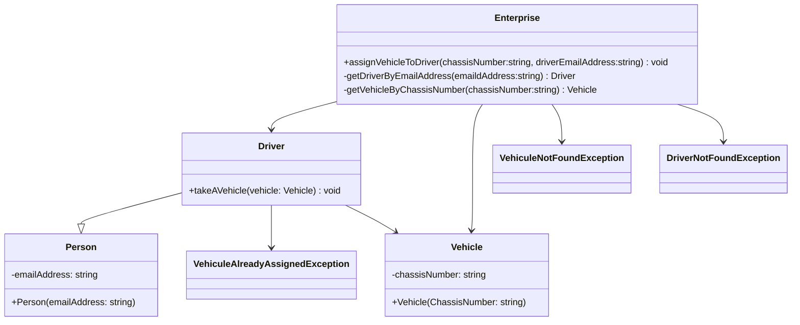

```mermaid
classDiagram
    class Enterprise {
        +assignVehicleToDriver(chassisNumber:string, driverEmailAddress:string) void
        -getDriverByEmailAddress(emaildAddress:string) Driver
        -getVehicleByChassisNumber(chassisNumber:string) Vehicle
    }

    class Person {
        -emailAddress: string
        +Person(emailAddress: string)
    }

    class Driver {
        +takeAVehicle(vehicle: Vehicle) void
    }

    class Vehicle {
        -chassisNumber: string
        +Vehicle(ChassisNumber: string)
    }

    class VehiculeAlreadyAssignedException

    class VehiculeNotFoundException

    class DriverNotFoundException

    Driver --|> Person

    Enterprise --> Driver
    Enterprise --> Vehicle

    Driver --> VehiculeAlreadyAssignedException

    Driver --> Vehicle

    Enterprise --> VehiculeNotFoundException
    Enterprise --> DriverNotFoundException
```